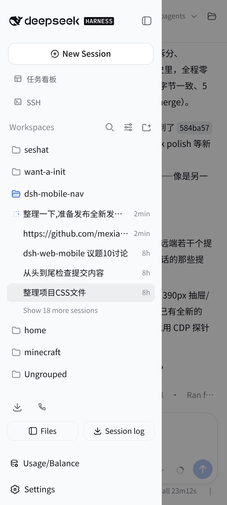

# dsh-handheld

> 独立维护副本：快照自 [mexiaosqwq/dsh-web-mobile](https://github.com/mexiaosqwq/dsh-web-mobile)（2026-08-17），**不与上游同步**，后续功能在本仓库自行演进。

尽可能的使dsh适配竖屏等移动端设备

[](package.json)
[](LICENSE)
[](cordis.patch.yml)

## 效果

| 会话主页(全宽) | 目录抽屉 | 设置界面 |
| --- | --- | --- |
|  |  |  |

## 特性

- **状态栏适配**:保留系统状态栏——viewport 加 `viewport-fit=cover`,页面各表面按 `env(safe-area-inset-top)` 下移,状态栏/刘海永不遮挡内容;`theme-color` 跟随主题背景(深/浅色自动切换),Android 状态栏与页面同色一体;`touch-action: manipulation` 禁用双击放大与 300ms 点击延迟(保留双指缩放);
- **会话全宽**:网格改为 `1fr 0 0`,目录抽屉 overlay 滑入,宽度贴合侧栏内容(约 280px),关闭后完全移出视口,左侧无阴影残留;
- **避开摄像头**:不做顶部预留空间,打开目录的浮动按钮放在左缘 y=72px(摄像头带下方);
- **会话头部重排**:移动端按 [目录按钮] [会话名称] [模式徽标] 排列;Session log 胶囊移到抽屉底部(Settings 旁),复用官方下载逻辑;
- **设置界面适配**:官方 800px 双栏弹窗改为近全宽 sheet——导航标签两行全可见、条目保持横向、Appearance 一行三选一、高度自适应、淡入动画;导出对话框保持官方居中卡片;
- **正文排版**:消息文字 16px → 15px,左右留白 32px → 20px,行宽更充分;抽屉列表与输入框文字不受影响;
- **Markdown 表格**:移动端表格不再 `max-content` 收缩,改为撑满消息列宽,减少表格内/右侧留白;
- **用户消息气泡**:移动端改为自适应宽度——短消息紧凑靠右,长消息可撑满消息列宽,避免短消息占太大面积;
- **输入框防重叠**:agent 权限胶囊(盾牌)与模型名不再重叠;
- **模型选择器**:底部模型名可展开完整显示;切换菜单在触发按钮上方水平居中,避免小屏下偏左/溢出;
- **底部控件间距**:权限、模型选择、上下文小圈间距调整为 12/10/12,布局更均衡;
- **统计栏一行滚动**:轮数/步数/耗时/TTFT/缓存/token 全部收进一条固定高度(28px)的横向滚动条,底部不再被撑高;
- **会话行操作菜单**:长按或右键会话行,右侧出现三点按钮(重命名 / Fork / 归档),点击时抽屉保持打开,菜单不再随抽屉收回;
- **抽屉导航判定**:点会话行本体切换会话并收起抽屉;行内按钮(三点菜单等)不触发收起;
- **文件树 / 预览浮层**:dsh-web-ui 的 Explorer 与 Preview 在手机上变为圆角底部浮层(文件树底部与输入框对齐),每次打开带滑入动画;预览浮层右上角缩放/收起按钮可正常关闭;
- **平板 / 宽幅移动端**:768–1023px 下设置弹窗与 Explorer/Preview 浮层不再铺满全宽,改为限宽居中,避免右侧大块空白;
- **一步打开文件**:会话头部右侧新增文件夹按钮,点击直接开/关文件树,无需先开侧栏抽屉;
- **全屏预览**:预览浮层可一键放大到全视口——缩放按钮固定在浮层标题栏,刘海区域自动避让;关闭浮层或抽屉时自动还原;
- **设置弹窗重构**:分类标签收进单行横向滚动(细滚动条提示可滚动),顶部工具栏并入标签行共用一行,手机上隐藏「打开配置文件」按钮;
- **分支胶囊**:git 分支芯片移入输入卡片内(todo 卡片上方),点击目标加大并带按压反馈;
- **会话头部紧凑**:模式徽标在窄处省略、subagent 按钮居中,文件按钮固定保留;
- **诊断徽章**:访问 `?mobile-nav-debug=1` 显示悬浮诊断条(URL/视口/媒体查询/浮层状态/JS 错误),手机端问题取证用。

## 更新日志

### v1.0.0

**新增 / 改进**

- 全屏预览浮层:预览底部浮层可一键放大到全视口(标题栏缩放按钮,刘海安全区适配),关闭预览或抽屉时自动还原;
- 设置弹窗重构:分类标签收进单行横向滚动(细滚动条提示),顶部工具栏并入标签行共用一行,手机上隐藏「打开配置文件」按钮,选项区显著变大;
- 分支胶囊:git 分支芯片移入输入卡片(todo 卡片之上),点击目标加大、按压即时反馈;
- 会话头部紧凑与顺序稳定:模式徽标窄处省略、subagent 按钮居中、文件按钮固定保留;
- 抽屉底部顺序:文件浏览 / 导出会话日志 固定在用量徽章之上;
- 模型 ID 完整显示:composer 行内有空间时不再省略;
- 文件树 / 预览交互:仅文件行可打开预览(目录行不再误弹缓存预览)、已选中行可重开、折叠按钮可靠关闭、预览打开时文件树自动让位;
- 诊断徽章:`?mobile-nav-debug=1` 实时显示 URL/视口/媒体查询/浮层/JS 错误,默认 no-op。

**修复**

- 目录选择器被设置弹窗规则劫持(issue #12):点笔形「编辑」进入手动输入后弹窗被顶到屏幕顶部、路径输入框被隐藏——目录选择器不再命中移动端设置适配规则;
- 预览浮层全屏几何规则回归(1779cd4)以及关闭后全屏标记残留;
- 抽屉底部徽章平票错序;subagent 弹层小屏溢出;统计栏误标 todo 面板。

**内部**

- CSS 按主题拆为 `src/client/styles/`(base / layout / compat / misc),client effects 拆分为独立模块;构建器支持子目录递归内联。

### v0.2.0

**新增 / 改进**

- 平板/宽幅移动端(768–1023px):设置弹窗与 Explorer/Preview 浮层限宽居中,避免右侧大块空白;
- Markdown 表格在移动端撑满消息列宽,减少表格内/右侧留白;
- 用户消息气泡自适应宽度:短消息紧凑靠右,长消息可撑满消息列宽;
- 模型选择器:模型名可完整显示,切换菜单在触发按钮上方水平居中;
- 底部权限/模型选择/上下文小圈间距优化(12/10/12)。

**修复**

- 预览浮层右上角缩放/收起按钮无法关闭的问题;
- 用户消息气泡全宽后因 `content-box` 导致溢出屏幕的问题;
- 模型切换菜单在小屏下偏左/溢出的问题。

## 兼容插件

- [dsh-web-ui 全家桶](https://www.npmjs.com/package/@linxin666/dsh-web-ui-all)(文件树 / 预览 / 任务看板 / SSH / 宠物 / 会话统计 / 远程配对 / 设置)——**0.1.14**
- [dshmarket](https://www.npmjs.com/package/dshmarket)(插件市场,搜索框换行全宽)——**1.2.2**
- [dsh-usage-stats](https://github.com/Ychris12138/dsh-usage-stats)(用量与余额)——**0.1.2**
- [dsh-genui](https://github.com/omdsh-dev/dsh-genui)(GenUI 内联组件 / 面板 dock)——**0.8.3**

## 安装

```sh
dsh plugin --profile web add github:yokuminto/dsh-handheld
```

仓库自带构建产物,一条命令直接安装,无 `allowBuilds` 拦截。装完重启 `dsh web`。

本地开发:`dsh plugin --profile web add link:/path/to/dsh-web-mobile`

## 构建

```sh
pnpm install
pnpm build
```

产物 `lib/` 与源码同步入库,改动源码后重新构建再提交。

## 验证

- `pnpm verify` 类型检查;`dsh --profile web --dump-config` 应出现插件层;
- 移动端(390px):rail 消失、抽屉开合/遮罩/Escape、设置弹窗适配、会话行三点菜单弹出时抽屉保持;
- 桌面端(≥1024px):与未安装时一致。

## 兼容性

需要 `:has()`(Chromium 105+);`prefers-reduced-motion: reduce` 下自动禁用动画。

## License

[MIT](LICENSE)
